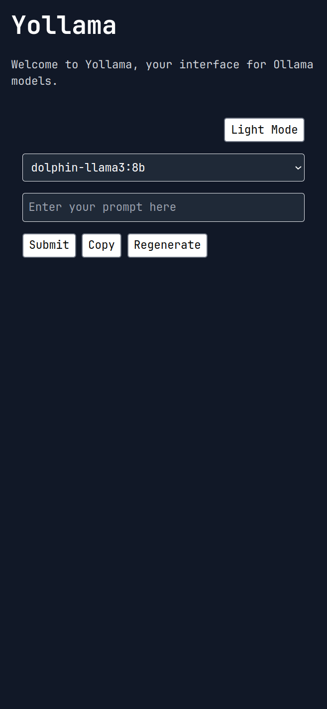

# Yollama

Yollama is a web-based user interface for interacting with locally installed Ollama models. It provides an intuitive interface for selecting models, sending prompts, and managing responses.




## Features

- Automatic detection of locally installed Ollama models
- Model selection via dropdown menu
- Text input for prompts
- Real-time streaming of model responses
- Copy response functionality
- Regenerate response option
- Dark mode toggle

## Tech Stack

- [Deno](https://deno.land/) - A secure runtime for JavaScript and TypeScript
- [Fresh](https://fresh.deno.dev/) - The next-gen web framework for Deno
- [Preact](https://preactjs.com/) - Fast 3kB alternative to React with the same modern API
- [Twind](https://twind.dev/) - The smallest, fastest, most feature complete Tailwind-in-JS solution

## Prerequisites

- [Deno](https://deno.land/#installation) v1.34.0 or higher
- [Ollama](https://ollama.ai/) installed and running locally

## Installation

1. Clone the repository:
   ```
   git clone https://github.com/yourusername/yollama.git
   cd yollama
   ```

2. Create a `.env` file in the project root and add the following:
   ```
   OLLAMA_API_URL=http://localhost:11434
   ```

## Running the Application

1. Start the development server:
   ```
   deno task start
   ```

2. Open your browser and navigate to `http://localhost:8000`

## Usage

1. Select an Ollama model from the dropdown menu
2. Enter your prompt in the text input field
3. Click "Submit" to generate a response
4. Use the "Copy" button to copy the response to your clipboard
5. Use the "Regenerate" button to generate a new response for the same prompt
6. Toggle between light and dark modes using the mode switch button

## Project Structure

- `routes/index.tsx`: Main page component
- `islands/OllamaInteraction.tsx`: Interactive component for model interaction
- `routes/api/models.ts`: API route for fetching available models
- `routes/api/generate.ts`: API route for generating responses
- `twind.config.ts`: Twind configuration for styling

## Contributing

Contributions are welcome! Please feel free to submit a Pull Request.

## License

This project is licensed under the MIT License - see the [LICENSE](LICENSE) file for details.

## Acknowledgments

- [Ollama](https://ollama.com/) for providing the local language model runtime
- [Deno](https://deno.land/) for the secure JavaScript/TypeScript runtime
- [Fresh](https://fresh.deno.dev/) for the web framework